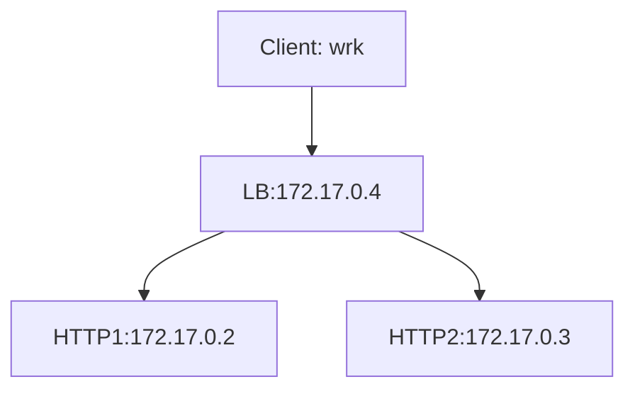

> 该文档主要是[《eBPF 核心技术与实战》](https://time.geekbang.org/column/intro/100104501)课程的笔记以及一些扩展。其中代码在[ebpf-learn-code](https://github.com/champly/ebpf-learn-code)仓库中，编译环境都在 `Docker` 镜像中，也具备 [cilium-ebpf](https://github.com/cilium/ebpf) 的编译环境。

## 什么是eBPF

`eBPF` 是从 `BPF` 技术扩展而来的，得益于 `BPF` 的设计:

- 内核态引入一个新的虚拟机(执行引擎)，所有指令都在内核虚拟机中运行；
- 用户态使用 `BPF` 字节码来定义过滤表达式，然后传递给内核，由内核虚拟机解释执行。

这就使得包过滤可以直接在内核中执行，避免了向用户态复制每个数据包，从而极大提升了包过滤的性能，进而被个大操作系统广泛接受。*而 `BPF` 最初的名字由最初的 `BSD Packet Filter` 变成了 `Berkeley Packet Filter`。*。

### 发展历程

- `BPF` 诞生五年后， `Linux` 2.1.75 首次引入了 `BPF` 技术;
- `Linux` 3.0 中增加的 `BPF` 即时编译器替换了原本性能较差的解释器，算是一个重大更新;
- 2014 年，为了研究新的SDN(软件定义网络)方案，第一次革命性的更新，将 `BPF` 扩展为一个通用的虚拟机，也就是 `eBPF`。不仅扩展了寄存器数量，引入了全新的 `BPF` 映射存储(Map)，还在 5.x 内核中将原本单一的数据包过滤事件逐步扩展到了内核态函数、用户态函数、跟踪点、性能事件(perf_events)以及安全控制等。(转折点)。

## 工作原理

`eBPF` 程序并不像常规的线程那样，启动后就一直运行在那里，它需要事件触发后才会执行。这些事件包括系统调用、内核跟踪点、内核函数和用户态函数的调用退出、网络事件等等，借助强大的内核态插桩(kprobe)和用户态插桩(uprobe)，`eBPF` 程序几乎可以在内核和应用的任意位置进行插桩。

> **确保安全和稳定一直都是 `eBPF` 的首要任务，不安全的 `eBPF` 程序根本就不会提交到内核虚拟机中执行。**

### 执行过程

如下图（图片来自[www.brendangregg.com](https://www.brendangregg.com/ebpf.html)）:


通常借助 `LLVM` 把编写的 `eBPF` 程序转换为 `BPF` 字节码，然后再通过 `bpf` 系统调用提交给内核执行。内核在接受 `BPF` 字节码之前，会首先通过验证器对字节码进行校验，只有通过校验的 `BPF` 字节码才会提交到即时编译器(JIT)执行。如果 `BPF` 字节码中包含了不安全的操作，验证器会直接拒绝 `BPF` 程序的执行：

- 只有特权进程才可以执行 `bpf` 系统调用;
- `BPF` 程序不能包涵无限循环;
- `BPF` 程序不能导致内核崩溃;
- `BPF` 程序必须在有限时间内完成。

`BPF` 程序可以利用 `BPF` 映射进行存储，而用户态程序通常也需要通过 `BPF` 映射同运行在内核中的 `BPF` 程序进行交互。如下图([ebpf.io](https://ebpf.io/what-is-ebpf/)):


### 限制

`eBPF` 不是万能的，有很多限制：

- `eBPF` 程序必须被验证器校验通过后才能执行，且不能包含无法到达的指令;
- `eBPF` 程序不能随意调用内核函数，只能调用在 `API` 中定义的辅助函数;
- `eBPF` 程序栈空间最多只有 512 字节，想要更大的存储，就必须要借助映射存储(Map);
- 在内核 5.2 之前，`eBPF` 字节码最多只支持 4096 条指令，而 5.2 内核把这个限制提高到了 100w 条;
- 由于内核的快速变化，在不同版本内核中运行时，需要访问内核数据结构的 `eBPF` 程序可能需要调整源码，并重写编译。

## 环境搭建

作为 `eBPF` 最重大的改进之一，一次编译到处执行(CO-RE)解决了内核数据结构在不同版本差异导致的兼容性问题，不过在使用 `CO-RE` 之前，需要内核开启 `CONFIG_DEBUG_INFO_BTF=y` 和 `CONFIG_DEBUG_INFO=y` 这两个编译选项。高版本已经默认开启，否则需要重新编译内核。

### 开发工具

主要包括:

- 将 `eBPF` 程序编译成字节码的 `LLVM`;
- `C` 语言程序编译工具 `make`;
- 最流行的 `eBPF` 工具集 `BCC` 和它依赖的内核头文件;
- 与内核代码仓库实时同步的 `libbpf`;
- 同样是内核代码提供的 `eBPF` 程序管理工具 `bpftool`。

可以通过下面的命令来统一安装:

``` shell
# For Ubuntu20.10+
sudo apt-get install -y  make clang llvm libelf-dev libbpf-dev bpfcc-tools libbpfcc-dev linux-tools-$(uname -r) linux-headers-$(uname -r)

# For RHEL8.2+
sudo yum install libbpf-devel make clang llvm elfutils-libelf-devel bpftool bcc-tools bcc-devel
```

也可以直接通过 [https://github.com/champly/ebpf-learn-code](https://github.com/champly/ebpf-learn-code) 这个项目里面的环境来学习和测试，直接 `make run` 就可以了。

## 开发

一般来说，`eBPF`的开发和执行过程分为以下 5 步:

- 使用 `C` 语言开发一个 `eBPF` 程序;
- 借助 `LLVM` 把 `eBPF` 程序编译成 `BPF` 字节码;
- 通过 `bpf` 系统调用，把 `BPF` 字节码提交给内核;
- 内核验证并运行 `BPF` 字节码，并把相应的程序状态保存到 `BPF` 映射中;
- 用户程序通过 `BPF` 映射查询 `BPF` 字节码的运行状态。

### BCC

`BCC` 是一个 `BPF` 编译器集合，包含了用于构建 `BPF` 程序的变成框架和库，并提供了大量可以直接使用的工具。把上述的 `eBPF` 执行过程通过内置框架抽象了起来，并提供了 `Python`、`C++` 等编程语言的接口，就可以简单通过 `Python` 语言去跟 `eBPF` 的各种事件和数据进行交互。

如下这个[代码](https://github.com/champly/ebpf-learn-code/tree/main/code/session3):

``` c trace-open.c
#include <linux/sched.h>
#include <uapi/linux/openat2.h>

struct data_t {
  u32 pid;
  u64 ts;
  char comm[TASK_COMM_LEN];
  char fname[NAME_MAX];
};

BPF_PERF_OUTPUT(events);

// define kprobe function
int hello_world2(struct pt_regs *ctx, int dfd, const char __user *filename,
                 struct open_how *how) {
  struct data_t data = {};

  // get PID & time
  data.pid = bpf_get_current_pid_tgid();
  data.ts = bpf_ktime_get_ns();

  // get program name
  if (bpf_get_current_comm(&data.comm, sizeof(data.comm)) == 0) {
    bpf_probe_read(&data.fname, sizeof(data.fname), (void *)filename);
  }

  // submit event
  events.perf_submit(ctx, &data, sizeof(data));
  return 0;
}
```

``` python trace-open.py
from bcc import BPF

# 1) load BPF program
b = BPF(src_file="trace-open.c")
b.attach_kprobe(event="do_sys_openat2", fn_name="hello_world2")

# 2) print header
print("%-18s %-16s %-6s %-16s" % ("TIME(s)", "COMM", "PID", "FILE"))

# 3) define the callback for perf event
start = 0
def print_event(cpu, data, size):
    global start
    event = b["events"].event(data)
    if start == 0:
        start = event.ts
    time_s = (float(event.ts - start)) / 1000000000
    print("%-18.9s %-16s %-6d %16s" % (time_s, event.comm, event.pid, event.fname))

# 4) loop with callback to print_event
b["events"].open_perf_buffer(print_event)
while 1:
    try:
        b.perf_buffer_poll()
    except KeyboardInterrupt:
        exit()
```

打开一个终端:

``` shell Terminal1
$ make run
sh docker-run.sh
root@9ceb0649d5e5:/# cd ~/code/session3/
root@9ceb0649d5e5:~/code/session3# python3 trace-open.py
TIME(s)            COMM             PID    FILE
```

打开另外一个终端:

``` shell Terminal2
# champly @ champlydeiMac in ~ [15:40:16]
$ docker exec -it ebpf-for-mac bash
root@9ceb0649d5e5:/# ls
bin  boot  dev  etc  home  lib  lib32  lib64  libx32  media  mnt  opt  proc  root  run  sbin  srv  sys  tmp  usr  var
root@9ceb0649d5e5:/#
```

同时可以看到第一个终端有数据输出:

``` shell Terminal1
TIME(s)            COMM             PID    FILE
0.0                b'ls'            8931   b'/etc/ld.so.cache'
0.0006603          b'ls'            8931   b'/lib/x86_64-linux-gnu/libselinux.so.1'
0.0007822          b'ls'            8931   b'/lib/x86_64-linux-gnu/libc.so.6'
0.0008942          b'ls'            8931   b'/lib/x86_64-linux-gnu/libpcre2-8.so.0'
0.0011795          b'ls'            8931   b'/proc/filesystems'
0.0013228          b'ls'            8931               b'.'
```

可以在第二个终端通过 `bpftool` 来查看 `eBPF` 程序的状态:

``` shell Terminal2
root@9ceb0649d5e5:/# bpftool prog list
3: cgroup_device  tag 531db05b114e9af3
	loaded_at 2022-12-02T01:02:16+0000  uid 0
	xlated 512B  jited 325B  memlock 4096B
	
......

155: kprobe  name hello_world2  tag c3d700bdee3931e4  gpl
	loaded_at 2022-12-06T07:41:43+0000  uid 0
	xlated 528B  jited 359B  memlock 4096B  map_ids 296
	btf_id 28
root@9ceb0649d5e5:/# bpftool map list
17: ringbuf  name blocked_packets  flags 0x0
	key 0B  value 0B  max_entries 16777216  memlock 0B
18: hash  name allowed_map  flags 0x0
	key 4B  value 4B  max_entries 10000  memlock 81920B
20: lpm_trie  name allowed_trie  flags 0x1
	key 8B  value 8B  max_entries 1024  memlock 16384B
297: perf_event_array  name events  flags 0x0
	key 4B  value 4B  max_entries 1  memlock 4096B
root@9ceb0649d5e5:/# bpftool map dump id 297
key:
00 00 00 00
value:
Unknown error 524
Found 0 elements
root@9ceb0649d5e5:/# bpftool prog dump xlated id 155
int hello_world2(struct pt_regs * ctx):
; int hello_world2(struct pt_regs *ctx) {
   0: (bf) r6 = r1
; int dfd = ctx->di; const char __user *filename = ctx->si; struct open_how *how = ctx->dx;
   1: (79) r7 = *(u64 *)(r6 +104)
   2: (b7) r1 = 0
; struct data_t data = {};
   3: (7b) *(u64 *)(r10 -8) = r1
   4: (7b) *(u64 *)(r10 -16) = r1
   5: (7b) *(u64 *)(r10 -24) = r1
   6: (7b) *(u64 *)(r10 -32) = r1
   7: (7b) *(u64 *)(r10 -40) = r1
   8: (7b) *(u64 *)(r10 -48) = r1
   9: (7b) *(u64 *)(r10 -56) = r1
  10: (7b) *(u64 *)(r10 -64) = r1
  11: (7b) *(u64 *)(r10 -72) = r1
  12: (7b) *(u64 *)(r10 -80) = r1
  13: (7b) *(u64 *)(r10 -88) = r1
  14: (7b) *(u64 *)(r10 -96) = r1
  15: (7b) *(u64 *)(r10 -104) = r1
  16: (7b) *(u64 *)(r10 -112) = r1
  17: (7b) *(u64 *)(r10 -120) = r1
  18: (7b) *(u64 *)(r10 -128) = r1
  19: (7b) *(u64 *)(r10 -136) = r1
  20: (7b) *(u64 *)(r10 -144) = r1
  21: (7b) *(u64 *)(r10 -152) = r1
  22: (7b) *(u64 *)(r10 -160) = r1
  23: (7b) *(u64 *)(r10 -168) = r1
  24: (7b) *(u64 *)(r10 -176) = r1
  25: (7b) *(u64 *)(r10 -184) = r1
  26: (7b) *(u64 *)(r10 -192) = r1
  27: (7b) *(u64 *)(r10 -200) = r1
  28: (7b) *(u64 *)(r10 -208) = r1
  29: (7b) *(u64 *)(r10 -216) = r1
  30: (7b) *(u64 *)(r10 -224) = r1
  31: (7b) *(u64 *)(r10 -232) = r1
  32: (7b) *(u64 *)(r10 -240) = r1
  33: (7b) *(u64 *)(r10 -248) = r1
  34: (7b) *(u64 *)(r10 -256) = r1
  35: (7b) *(u64 *)(r10 -264) = r1
  36: (7b) *(u64 *)(r10 -272) = r1
  37: (7b) *(u64 *)(r10 -280) = r1
  38: (7b) *(u64 *)(r10 -288) = r1
; data.pid = bpf_get_current_pid_tgid();
  39: (85) call bpf_unspec#0
; data.pid = bpf_get_current_pid_tgid();
  40: (63) *(u32 *)(r10 -288) = r0
; data.ts = bpf_ktime_get_ns();
  41: (85) call bpf_unspec#0
; data.ts = bpf_ktime_get_ns();
  42: (7b) *(u64 *)(r10 -280) = r0
; struct data_t data = {};
  43: (bf) r1 = r10
  44: (07) r1 += -272
; if (bpf_get_current_comm(&data.comm, sizeof(data.comm)) == 0) {
  45: (b7) r2 = 16
  46: (85) call bpf_unspec#0
  47: (67) r0 <<= 32
  48: (77) r0 >>= 32
; if (bpf_get_current_comm(&data.comm, sizeof(data.comm)) == 0) {
  49: (55) if r0 != 0x0 goto pc+5
; bpf_probe_read(&data.fname, sizeof(data.fname), (void *)filename);
  50: (bf) r1 = r10
  51: (07) r1 += -256
; bpf_probe_read(&data.fname, sizeof(data.fname), (void *)filename);
  52: (b7) r2 = 255
  53: (bf) r3 = r7
  54: (85) call bpf_unspec#0
; bpf_perf_event_output(ctx, bpf_pseudo_fd(1, -1), CUR_CPU_IDENTIFIER, &data, sizeof(data));
  55: (18) r2 = map[id:297]
  57: (bf) r4 = r10
  58: (07) r4 += -288
; bpf_perf_event_output(ctx, bpf_pseudo_fd(1, -1), CUR_CPU_IDENTIFIER, &data, sizeof(data));
  59: (bf) r1 = r6
  60: (18) r3 = 0xffffffff
  62: (b7) r5 = 288
  63: (85) call bpf_unspec#0
; return 0;
  64: (b7) r0 = 0
  65: (95) exit
```

可以查看到刚运行的 `eBPF` 程序的状态和 `map` 中的值，还有 `eBPF` 程序指令，通过 `bpftool prog dump jited id $ID` 可以查看到最后经过 `JIT` 编译之后的指令(当前 `Docker` 环境不支持，如果可以支持，请告诉我)。

还可以通过 `strace` 来查看 `eBPF` 程序的执行过程:

``` shell
root@9ceb0649d5e5:~/code/session3# strace -v -f -ebpf ./hello.py
......
bpf(
    BPF_PROG_LOAD, 
    {
        prog_type=BPF_PROG_TYPE_KPROBE, 
        insn_cnt=13, 
        insns=[
            {code=BPF_ALU64|BPF_K|BPF_MOV, dst_reg=BPF_REG_1, src_reg=BPF_REG_0, off=0, imm=0x21646c72}, 
            {code=BPF_STX|BPF_W|BPF_MEM, dst_reg=BPF_REG_10, src_reg=BPF_REG_1, off=-8, imm=0}, 
            {code=BPF_LD|BPF_DW|BPF_IMM, dst_reg=BPF_REG_1, src_reg=BPF_REG_0, off=0, imm=0x6c6c6548}, 
            {code=BPF_LD|BPF_W|BPF_IMM, dst_reg=BPF_REG_0, src_reg=BPF_REG_0, off=0, imm=0x6f57206f}, 
            {code=BPF_STX|BPF_DW|BPF_MEM, dst_reg=BPF_REG_10, src_reg=BPF_REG_1, off=-16, imm=0}, 
            {code=BPF_ALU64|BPF_K|BPF_MOV, dst_reg=BPF_REG_1, src_reg=BPF_REG_0, off=0, imm=0}, 
            {code=BPF_STX|BPF_B|BPF_MEM, dst_reg=BPF_REG_10, src_reg=BPF_REG_1, off=-4, imm=0}, 
            {code=BPF_ALU64|BPF_X|BPF_MOV, dst_reg=BPF_REG_1, src_reg=BPF_REG_10, off=0, imm=0}, 
            {code=BPF_ALU64|BPF_K|BPF_ADD, dst_reg=BPF_REG_1, src_reg=BPF_REG_0, off=0, imm=0xfffffff0}, 
            {code=BPF_ALU64|BPF_K|BPF_MOV, dst_reg=BPF_REG_2, src_reg=BPF_REG_0, off=0, imm=0xd}, 
            {code=BPF_JMP|BPF_K|BPF_CALL, dst_reg=BPF_REG_0, src_reg=BPF_REG_0, off=0, imm=0x6}, 
            {code=BPF_ALU64|BPF_K|BPF_MOV, dst_reg=BPF_REG_0, src_reg=BPF_REG_0, off=0, imm=0}, 
            {code=BPF_JMP|BPF_K|BPF_EXIT, dst_reg=BPF_REG_0, src_reg=BPF_REG_0, off=0, imm=0}
        ], 
        license="GPL", 
        log_level=0, 
        log_size=0, 
        log_buf=NULL, 
        kern_version=KERNEL_VERSION(5, 15, 49), 
        prog_flags=0, 
        prog_name="hello_world", 
        prog_ifindex=0, 
        expected_attach_type=BPF_CGROUP_INET_INGRESS, 
        prog_btf_fd=3, 
        func_info_rec_size=8, 
        func_info=0x55d9d310c030, 
        func_info_cnt=1, 
        line_info_rec_size=16, 
        line_info=0x55d9d30ebf10, 
        line_info_cnt=5, 
        attach_btf_id=0, 
        attach_prog_fd=0, 
        fd_array=NULL
    }, 144) = 4
```

*如果去掉 `-ebpf` 可以看到更多的过程。*

### 内核调用

对于用户态程序来说，它们与内核交互时必须要通过系统调用来完成。而对于 `eBPF` 程序需要通过 `bpf` 系统调用 `man bpf`:

``` shell
NAME
       bpf - perform a command on an extended BPF map or program

SYNOPSIS
       #include <linux/bpf.h>

       int bpf(int cmd, union bpf_attr *attr, unsigned int size);
```

[include/uapi/linux/bpf.h](https://elixir.bootlin.com/linux/v6.1-rc8/source/include/uapi/linux/bpf.h#L865) 可以查看支持的 `BPF` 命令。

#### BPF 命令

| BPF命令                                                                                                                     | 功能描述                                                                              |
| :-:                                                                                                                         | :-:                                                                                   |
| BPF_MAP_CREATE                                                                                                              | 创建一个 BPF 映射                                                                     |
| BPF_MAP_LOOKUP_ELEM<br>BPF_MAP_UPDATE_ELEM<br>BPF_MAP_DELETE_ELEM<br>BPF_MAP_LOOKUP_AND_DELETE_ELEM<br>BPF_MAP_GET_NEXT_KEY | BPF 映射相关的操作命令，包括查找、更新、删除以及遍历等                                |
| BPF_PROG_LOAD                                                                                                               | 验证并加载 BPF 程序                                                                   |
| BPF_PROG_ATTACH                                                                                                             | 把 BPF 程序挂载到内核事件上                                                           |
| BPF_PROG_DETACH                                                                                                             | 把 BPF 程序从内核事件上卸载                                                           |
| BPF_OBJ_PIN                                                                                                                 | 把 BPF 程序或映射挂载到sysfs中的/sys/fs/bpf目录中 （常用于保持 BPF 程序在内核中贮存） |
| BPF_OBJ_GET                                                                                                                 | 从/sys/fs/bpf目录中查找 BPF 程序 BPF_BTF_LOAD 验证并加载 BTF 信息                     |

#### BPF 辅助函数

可以通过 `bpftool feature probe` 来查询当前系统支持的辅助函数列表，详细定义可以使用 `man bpf-helpers`，或者参考内核头文件 [/include/uapi/linux/bpf.h](https://elixir.bootlin.com/linux/v6.1-rc8/source/include/uapi/linux/bpf.h#L1567):

| 辅助函数                                                                                                       | 功能描述                                                                             |
| :-:                                                                                                            | :-:                                                                                  |
| bpf_trace_printk(fmt, fmt_size, ...)                                                                           | 向调试文件系统写入调试信息                                                           |
| bpf_map_lookup_elem(map, key)<br>bpf_map_update_elem(map, key, value, flags)<br>bpf_map_delete_elem(map, key)  | BPF映射操作函数，分别是查找、更新和删除元素                                          |
| bpf_probe_read(dst, size, ptr)<br>bpf_probe_read_user(dst, size, ptr)<br>bpf_probe_read_kernel(dst, size, ptr) | 从内存指针中读取数据<br>从用户空间内存指针中读取数据<br>从内核空间内存指针中读取数据 |
| bpf_ktime_get_ns()                                                                                             | 获取系统启动以来的时长，单位纳秒                                                     |
| bpf_get_current_pid_tgid()                                                                                     | 获取当前线程的TGID（高32位）和PID（低32位）                                          |
| bpf_get_current_comm(buf, size)                                                                                | 获取当前线程的任务名称                                                               |
| bpf_get_current_task()                                                                                         | 获取当前任务的task结构体                                                             |
| bpf_perf_event_output(ctx, map, flags, data, size)                                                             | 向性能事件缓冲区中写入数据                                                           |
| bpf_get_stackid(ctx, map, flags)                                                                               | 获取内核态和用户态调用栈                                                             |

#### BPF 映射

`BPF` 映射用于提供大块的键值存储，这些存储可被用户控件程序访问，进而获取 `ePBF` 程序的运行状态。`eBPF` 程序最多可以访问 64 个不同的 `BPF` 映射，并且不同的 `eBPF` 程序也可以通过相同的 `BPF` 映射来共享它们的状态。


`BPF` 映射只能通过用户态程序的系统调用来创建，内核头文件 [/include/uapi/linux/bpf.h](https://elixir.bootlin.com/linux/v6.1-rc8/source/include/uapi/linux/bpf.h#L905) 中的 `bpf_map_type` 定义了所有支持的映射类型，也可以通过 `bpftool feature probe | grep map_type` 来查询当前系统支持哪些映射。

| 映射类型                                                                    | 功能描述                                                                       |
| :-:                                                                         | :-:                                                                            |
| BPF_MAP_TYPE_HASH                                                           | 哈希表映射，用于保存 key/value对                                               |
| BPF_MAP_TYPE_LRU_HASH                                                       | 类似于哈希表映射，但在表满的时候自动按LRU 算法删除最久未被使用的元素           |
| BPF_MAP_TYPE_ARRAY                                                          | 数组映射，用于保存固定大小的数组（注意数组元素无法删除）                       |
| BPF_MAP_TYPE_PROG_ARRAY                                                     | 程序数组映射，用于保存 BPF 程序的引用，特别适合于尾调用（即调用其他 eBPF 程序) |
| BPF_MAP_TYPE_PERF_EVENT_ARRAY                                               | 性能事件数组映射，用于保存性能事件跟踪记录                                     |
| BPF_MAP_TYPEPERCPU_HASH<br>BPF_MAP_TYPE_PERCPU_ARRAY                        | 每个 CPU 单独维护的哈希表和数组映射                                            |
| BPF_MAP_TYPE_STACK_TRACE                                                    | 调用栈跟踪映射，用于存储调用栈信息                                             |
| BPF_MAP_TYPE_ARRAY_OF_MAPS<br>BPF_MAP_TYPE_HASH_OF_MAPS                     | 映射数组和映射哈希，用于保存其他映射的引用                                     |
| BPF_MAP_TYPE_CGROUP_ARRAY                                                   | CGROUP 数组映射，用于存储 cgroups 引用                                         |
| BPF_MAP_TYPE_SOCKMAP                                                        | 套接字映射，用于存储套接字引用，特别适用于套接字重定向                         |

> ** BPF 映射会在用户态程序关闭文件描述符的时候自动删除**，如果想在程序退出后还保留映射，需要调用 `BPF_OBJ_PIN` 命令，将映射挂载到 `/sys/fs/bpf` 中。

通过 `bpftool` 来查看或操作映射的具体内容:

``` shell
root@76f664f7d01b:~/code/session3# bpftool map create /sys/fs/bpf/stats_map type hash key 2 value 2 entries 8 name stats_map
root@76f664f7d01b:~/code/session3# bpftool map
17: ringbuf  name blocked_packets  flags 0x0
	key 0B  value 0B  max_entries 16777216  memlock 0B
18: hash  name allowed_map  flags 0x0
	key 4B  value 4B  max_entries 10000  memlock 81920B
20: lpm_trie  name allowed_trie  flags 0x1
	key 8B  value 8B  max_entries 1024  memlock 16384B
304: hash  name stats_map  flags 0x0
	key 2B  value 2B  max_entries 8  memlock 4096B
root@76f664f7d01b:~/code/session3# bpftool map update name stats_map key 0xc1 0xc2 value 0xa1 0xa2
root@76f664f7d01b:~/code/session3# bpftool map dump name stats_map
key: c1 c2  value: a1 a2
Found 1 element
root@76f664f7d01b:~/code/session3# rm /sys/fs/bpf/stats_map
root@76f664f7d01b:~/code/session3#
```

#### BPF 类型格式(BTF)

开发 `eBPF` 程序时最常碰到的问题：内核数据结构的定义。安装 `BCC` 工具的时候会安装 `linux-headers-${uname -r}` 依赖项。因为 `BCC` 在编译的时候需要从内核头文件中找到相应的内核数据结构定义。但是编译时依赖内核头文件也会带来很多问题:

- `eBPF` 程序开发的时候为了获得内核数据结构的定义，就需要引入一大堆的内核头文件;
- 内核头文件的路径和数据结构定义在不同内核版本中很可能不同。因此，在升级内核版本时，就会遇到找不到头文件和数据结构定义错误的问题;
- 在很多生产环境的机器中，出于安全考虑，并不允许安装内核头文件，这时就无法得到内核数据结构的定义。在程序中定义数据结构虽然可以暂时解决问题，但也很容易把使用着错误数据结构的 `eBPF` 程序带入新版本内核中运行。

`BPF` 类型格式(BPF Type Format,BTF) 的诞生就是为了解决这些问题。从内核 5.2 开始，只要开启了 `CONFIG_DEBUG_INFO_BTF`，在编译内核时，内核数据结构的定义就会自动内嵌在内核二进制文件 `vmlinux` 中。可以借助下面的命令把这些数据结构的定义导出到一个头文件中 `vmlinux.h`。

``` shell
bpftool btf dump file /sys/kernel/btf/vmlinux format c > vmlinux.h
```

解决了内核数据结构的定义问题，接下来就是**如何让eBPF程序在升级内核之后，不需要重新编译就可以直接运行**(CO-RE)，`eBPF` 的一次编译到处执行项目借助了 `BTF` 提供的调试信息，再通过下面两个步骤，使得 `eBPF` 程序可以适配不同版本的内核:

- 通过对 `BPF` 代码中的访问偏移量进行重写，解决了不同内核版本中数据结构偏移量不同的问题;
- 在 `libbpf` 中预定不同内核版本中的数据结构的修改，解决了不同内核数据结构不兼容的问题。

### 分类

#### 跟踪类

主要用于从系统中提取跟踪信息，进而为监控、排错、性能优化等提供数据支撑:

| 程序类型                                                                | 功能描述                                                                                | 功能限制                                                                                   |
| :-:                                                                     | :-:                                                                                     | :-:                                                                                        |
| BPF_PROG_TYPE_KPROBE                                                    | 用于对特定函数进行动态插桩，根据函数位置的不同，又可以分为内核态 kprobe 和用户态 uprobe | 内核函数和用户函数的定义属于不稳定 API，在不同内核版本中使用时，可能需要调整 eBPF 代码实现 |
| BPF_PROG_TYPETRACEPOINT                                                 | 用于内核静态跟踪点（可以 使用 perf list 命令，查询所 有的跟踪点）                       | 虽然跟踪点可以保持稳定性，但不如 KPROBE 类型 灵活，无法按需增加新的跟踪点                  |
| BPF_PROG_TYPE_PERF_EVENT                                                | 用于性能事件 (perf_events）跟踪，包括 内核调用、定时器、硬件等 各类性能数据             | 需配合 BPF_MAP_TYPE_PERF_EVENT_ARRAY 或 BPF_MAP_TYPE_RINGBUF 类型的映射使用                |
| BPF_PROG_TYPE_RAW_TRACEPOINT<br>BPF_PROG_TYPE_RAW_TRACEPOINT_WRITABLE   | 用于原始跟踪点                                                                          | 不处理参数                                                                                 |
| BPF_PROG_TYPE_TRACING                                                   | 用于开启 BTF 的跟踪点 需要开启 BTF                                                      |                                                                                            |

#### 网络类

主要用于对网络数据包进行过滤和处理，进而实现网络对观测、过滤、流量控制以及性能优化等各种丰富的功能。根据事件触发的位置不同，又可以分为 `XDP`(eXpress Data Path, 高速数据路径)程序、`TC`(Traffic Control, 流量控制)程序、套接字程序以及 `cgroup` 程序:

##### XDP

在网络驱动程序刚刚收到数据包时触发执行。由于无需通过繁杂的内核网络协议栈，`XDP` 程序可以用来实现高性能的网络处理方案，常用于 `DDos` 防御、防火墙、4 层负载均衡等场景。根据网卡和网卡驱动是否是原生支持 `XDP` 程序，`XDP` 运行模式可以分为:

- 通用模式：不需要网卡和网卡驱动支持，XDP 程序像常规的网络协议栈一样运行在内核中，性能相对较差，一般用于测试;
- 原生模式：需要网卡驱动支持，XDP 程序在网卡驱动程序的早期路径运行;
- 卸载模式：需要网卡固件支持 XDP 卸载，XDP 程序直接运行在网卡上，而不再需要消耗主机的 CPU 资源，具有最好的性能。

不管什么模式，`XDP` 程序在处理过网络包之后，都需要根据 `eBPF` 程序执行的结果决定数据包的去处：

| 结果码                 | 含义                          | 使用场景                                                                              |
| :-:                    | :-:                           | :-:                                                                                   |
| XDP_DROP               | 丢包                          | 数据包尽早丢弃可以减少 CPU 处理时间，因而常用于防火墙、DDos 防御等丢弃非法包的场景    |
| XDP_PASS               | 传递到内核协议栈              | 内核协议栈接收到网络包，按正常流程继续处理                                            |
| XDP_TX<br>XDP_REDIRECT | 转发数据包到同一网卡/不同网卡 | 数据包在 XDP 程序修改后转发到网卡中，继续按正常的内核协议栈流程处理，常用在负载均衡中 |
| XDP_ABORTED            | 错误                          | XDP 程序运行错误，数据包丢弃并记录错误行为，以便排错                                  |

> **只能用于接收!**

##### TC

定义为 `BPF_PROG_TYPE_SCHED_CLS` 和 `BPF_PROG_TYPE_SCHED_ACT`，分别作为 Linux 流量控制的分类器和执行器。得益于内核 4.4 引入的 `direct-action` 模式，`TC` 程序可以直接在一个程序内完成分类和执行的动作，无需再调用其他的 `TC` 排队规则和分类器。

同 `XDP` 程序相比，`TC` 程序可以直接获取内核解析后的网络报文数据结构 `sk_buff` (`XDP` 是 `xdp_buff`)，并且可以在**网卡的接收和发送两个方向上执行**:

- 对于接收网络包，TC 程序在网卡接收(GRO)之后、协议栈处理(包括 IP 层处理和 iptables 等)之前执行;
- 对于发送的网络包，TC 程序在协议处理（包括 IP 层处理和 iptables 等）之后、数据包发送到网卡队列(GSO)之前执行。


##### 套接字

用于过滤、观测或重定向套接字网络包，根据类型的不同，可以挂载到套接字(socket)、控制组(cgroup)以及网络命名空间(netns)等各个位置:

| 套接字程序类型              | 应用场景                                                                                               | 挂载方法                                                                                                                                                                       |
| :-:                         | :-:                                                                                                    | :-:                                                                                                                                                                            |
| BPF_PROG_TYPE_SOCKET_FILTER | 用于套接字过滤和观测                                                                                   | 用户态程序可通过系统调用 setsockopt(sock, SOL_SOCKET, SO_ATTACH_BPF,...），绑定 BPF 程序到具体的 socket 上                                                                     |
| BPF_PROG_TYPE_SOCKOPS       | 用于套接字修改或重定向                                                                                 | 用户态程序可通过 BPF 系统调用的 BPF_PROG_ATTACH 命令（指定挂载类型为 BPF_CGROUP_SOCK_OPS)，将其挂载到 cgroup 上                                                                |
| BPF_PROG_TYPE_SKSKB         | 用于套接字修改或消息流动态解析                                                                         | 用户态程序可通过 BPF 系统调用的 BPF_PROG_ATTACH 命令（指定挂载类型为 BPF_SK_SKB_STREAM_VERDICT 或 BPF_SK_SKB_STREAM_PARSER)，将其挂载到 BPF_MAP_TYPE_SOCKMAP 类型的 BPF 映射上 |
| BPF_PROG_TYPESKMSG          | 用于控制内核是否发送消息到套接字                                                                       | 用户态程序可通过 BPF 系统调用的 BPF_PROG_ATTACH 命令（指定挂载类型为 BPF_SK_MSG_VERDICT) 将其挂载到 BPF_MAP_TYPE_SOCKMAP 类型的 BPF 映射上                                     |
| BPF_PROG_TYPE_SK_REUSEPORT  | 用于控制端口是否重用                                                                                   | 用户态程序可通过系统调用 setsockopt(sock, SOL_SOCKET, SO_ATTACH_REUSEPORT_EBPF, …），绑定 BPF 程序到具体的 socket 上                                                           |
| BPF_PROG_TYPE_SK_LOOKUP     | 用于为新的 TCP 连接选择监听套接字，或为 UDP 数据包选择未连接的套接字，可用来绕过 bind 系统调用的限制   | 用户态程序可通过系统调用 bpf(BPF_LINK_CREATE,.，绑定 BPF 程序到网 络命名空间 (netns)上                                                                                         |

##### cgroup

用于对 cgroup 内所有进程的网络过滤、套接字选项以及转发等进行动态控制，最典型的应用场景是对容器中运行的多个进程进行网络控制:

| cgroup 程序类型               | 应用场景                                                               |
| :-:                           | :-:                                                                    |
| BPF_PROG_TYPECGROUP_SKB       | 在入口和出口过滤数据包，并可以接受或拒绝数据包                         |
| BPF_PROG_TYPE_CGROUP_SOCK     | 在套接字创建、释放和绑定地址时，接受或拒绝操作，也可用来统计套接字信息 |
| BPF_PROG_TYPE_CGROUP_SOCKOPT  | 在 setsockopt 和 getsockopt 操作中修改套接字选项                       |
| BPF_PROG_TYPE_CGROUP_SOCKADDR | 在 connect、 bind、 sendto 和 recvmsg 操作中，修改 IP 地址和端口       |
| BPF_PROG_TYPE_CGROUP_DEVICE   | 对设备文件的访问进行过滤                                               |
| BPF_PROG_TYPE_CGROUP_SYSCTL   | 对 sysctl 的访问进行过滤                                               |

#### 其他类型

| BPF程序类型                                                             | 应用场景                                                          |
| :-:                                                                     | :-:                                                               |
| BPF PROG_TYPE_LSM                                                       | 用于 Linux 安全模块(Linux Security Module,LSM）访问控制和审计策略 |
| BPF_PROG_TYPE_LWT_IN<br>BPF_PROG_TYPE_LWT_OUT<br>BPF_PROG_TYPE_LWT_XMIT | 用于轻量级隧道（如 vxlan、 mpls 等）的封装或解封装                |
| BPF_PROG_TYPE_LIRC_MODE2                                                | 用于红外设备的远程遥控                                            |
| BPF_PROG_TYPE_STRUCT_OPS                                                | 用于修改内核结构体，目前仅支持拥塞控制算法 tcp_congestion_ops     |
| BPF_PROG_TYPE_FLOW_DISSECTOR                                            | 用于内核流量解析器 (Flow Dissector)                               |
| BPF_PROG_TYPE_EXT                                                       | 用于扩展BPF程序                                                   |


### bpftrace

`bpftrace` 在 `eBPF` 和 `BCC` 之上构建了一个简化的跟踪语言，通过简单的几行脚本，就可以实现复杂的追踪功能。[如下图](https://github.com/iovisor/bpftrace/blob/master/docs/internals_development.md) 所示, `bpftrace` 会把开发的脚本借助 `BCC` 编译加载到内核中执行，再通过 `BPF` 映射获取执行结果:


通过 `bpftrace -l` 可以查询内核插桩和跟踪点 `-v` 可以查看函数的入口参数和返回值。

> **在内核插桩和跟踪点两者都可以用的情况下，应该选择更稳定的跟踪点，以保证 eBPF 程序的可移植性(即在不同的内核中都可以正常执行)。**

``` shell
root@f287ed60a8b5:/# bpftrace -lv 'tracepoint:syscalls:sys_enter_execve'
tracepoint:syscalls:sys_enter_execve
    int __syscall_nr
    const char __attribute__((user)) * filename
    const char __attribute__((user)) *const __attribute__((user)) * argv
    const char __attribute__((user)) *const __attribute__((user)) * envp
root@f287ed60a8b5:/# bpftrace -lv 'tracepoint:syscalls:sys_exit_execve'
tracepoint:syscalls:sys_exit_execve
    int __syscall_nr
    long ret
root@f287ed60a8b5:/# bpftrace -lv 'tracepoint:syscalls:sys_enter_execveat'
tracepoint:syscalls:sys_enter_execveat
    int __syscall_nr
    int fd
    const char __attribute__((user)) * filename
    const char __attribute__((user)) *const __attribute__((user)) * argv
    const char __attribute__((user)) *const __attribute__((user)) * envp
    int flags
root@f287ed60a8b5:/# bpftrace -lv 'tracepoint:syscalls:sys_exit_execveat'
tracepoint:syscalls:sys_exit_execveat
    int __syscall_nr
    long ret
```

通过这个[代码](https://github.com/champly/ebpf-learn-code/blob/main/code/session7/bpftrace/sys_enter.bt)可以达到上面的 `BCC` 事例的效果:

``` shell
root@f287ed60a8b5:~/code/session7/bpftrace# bpftrace sys_enter.bt
Attaching 2 probes...
14:37:54  1785   0      bash            bpftool prog list
```

#### 查询用户程序跟踪点

可以通过 `readelf` 查询二进制文件的基本信息，使用[这个](https://github.com/champly/ebpf-learn-code/blob/main/code/session9/main.go) `Go` 语言项目来示范:

``` go
package main

import (
	"fmt"
	"math/rand"
	"time"
)

func main() {
	rand.Seed(int64(time.Now().Nanosecond()))
	i := rand.Intn(10)
	a := callbackTP(i)
	fmt.Println(a)
}

// go:noinline
func callbackTP(i int) int {
	if i < 5 {
		return i
	}

	for a := 0; a < i; a++ {
		fmt.Printf("xxxxx %d", a)
	}

	return 99
}
```

可以在上面的容器环境中调试，`cd /root/code/session9 && go build main.go` 进行编译，然后通过 `readelf` 查看对应的信息:


``` shell
# 查询符号表
root@76f664f7d01b:~/code/session9# readelf -Ws ./main

Symbol table '.symtab' contains 2136 entries:
   Num:    Value          Size Type    Bind   Vis      Ndx Name
     0: 0000000000000000     0 NOTYPE  LOCAL  DEFAULT  UND
     1: 0000000000000000     0 FILE    LOCAL  DEFAULT  ABS go.go
     2: 0000000000401000     0 FUNC    LOCAL  DEFAULT    1 runtime.text
     3: 0000000000402140   557 FUNC    LOCAL  DEFAULT    1 cmpbody
     4: 00000000004023a0   318 FUNC    LOCAL  DEFAULT    1 memeqbody
     5: 0000000000402520   279 FUNC    LOCAL  DEFAULT    1 indexbytebody
     6: 0000000000459f60    64 FUNC    LOCAL  DEFAULT    1 gogo
     7: 0000000000459fa0    53 FUNC    LOCAL  DEFAULT    1 callRet
     8: 0000000000459fe0    47 FUNC    LOCAL  DEFAULT    1 gosave_systemstack_switch
     9: 000000000045a020    13 FUNC    LOCAL  DEFAULT    1 setg_gcc
    10: 000000000045a040  1370 FUNC    LOCAL  DEFAULT    1 aeshashbody
    11: 000000000045a5a0    75 FUNC    LOCAL  DEFAULT    1 debugCall32
......

# 查询USDT信息（USDT信息位于ELF文件的notes段）
root@76f664f7d01b:~/code/session9# readelf -n ./main

Displaying notes found in: .note.go.buildid
  Owner                Data size 	Description
  Go                   0x00000053	GO BUILDID
   description data: 4e 6d 53 72 46 41 6d 53 44 30 6a 69 5a 6e 73 51 55 5a 74 55 2f 45 56 77 62 5a 5a 33 31 33 35 59 4f 76 5f 51 75 30 70 5a 61 2f 43 46 50 62 66 2d 67 78 4a 39 74 31 61 69 78 53 51 4b 57 32 2f 33 76 67 6b 73 51 37 38 5a 4f 73 7a 4c 5a 33 6e 41 4d 4d 52
```

也可以通过 `bpftrace` 来查看:

``` shell
# 查询 uprobe
root@76f664f7d01b:~/code/session9# bpftrace -l "uprobe:./main:*"
uprobe:./main:_rt0_amd64
uprobe:./main:_rt0_amd64_linux
uprobe:./main:aeshashbody
uprobe:./main:callRet
uprobe:./main:cmpbody
uprobe:./main:debugCall1024
uprobe:./main:debugCall128
uprobe:./main:debugCall16384
uprobe:./main:debugCall2048
uprobe:./main:debugCall256
uprobe:./main:debugCall32
uprobe:./main:debugCall32768
uprobe:./main:debugCall4096

# 查询 usdt，这里的 Go 项目没有，通过 /usr/lib/x86_64-linux-gnu/libc.so.6 来替换
root@76f664f7d01b:~/code/session9# bpftrace -l 'usdt:/usr/lib/x86_64-linux-gnu/libc.so.6:*'
usdt:/usr/lib/x86_64-linux-gnu/libc.so.6:libc:cond_broadcast
usdt:/usr/lib/x86_64-linux-gnu/libc.so.6:libc:cond_destroy
usdt:/usr/lib/x86_64-linux-gnu/libc.so.6:libc:cond_init
usdt:/usr/lib/x86_64-linux-gnu/libc.so.6:libc:cond_signal
usdt:/usr/lib/x86_64-linux-gnu/libc.so.6:libc:cond_wait
usdt:/usr/lib/x86_64-linux-gnu/libc.so.6:libc:lll_lock_wait
usdt:/usr/lib/x86_64-linux-gnu/libc.so.6:libc:lll_lock_wait_private
usdt:/usr/lib/x86_64-linux-gnu/libc.so.6:libc:longjmp
usdt:/usr/lib/x86_64-linux-gnu/libc.so.6:libc:longjmp_target
usdt:/usr/lib/x86_64-linux-gnu/libc.so.6:libc:memory_arena_new
```

> **想要通过二进制文件查询符号表和参数定义，必须在编译的时候保留 DWARF 调试信息。**

#### 跟踪 Go 程序的执行

``` shell Terminal1:
root@76f664f7d01b:~/code/session9# bpftrace -e '
        uprobe:./main:main.callbackTP { printf("main.callbackTP i: %d => ", reg("ax")) }
        uretprobe:./main:main.callbackTP { printf("return %d\n", retval) }
'
Attaching 2 probes...
main.callbackTP i: 0 => return 0
main.callbackTP i: 2 => return 2
main.callbackTP i: 8 => return 99
main.callbackTP i: 6 => return 99
```

``` shell Terminal2
# champly @ champlydeiMac in ~ [10:55:20]
$ docker exec -it ebpf-for-mac bash
root@76f664f7d01b:/# cd /root/code/session9
root@76f664f7d01b:~/code/session9# ./main
0
root@76f664f7d01b:~/code/session9# ./main
2
root@76f664f7d01b:~/code/session9# ./main
xxxxx 0xxxxx 1xxxxx 2xxxxx 3xxxxx 4xxxxx 5xxxxx 6xxxxx 799
root@76f664f7d01b:~/code/session9# ./main
xxxxx 0xxxxx 1xxxxx 2xxxxx 3xxxxx 4xxxxx 599
```

可以看到可以查询到 `callbackTP` 函数调用的入参和返回值。

### libbpf

通过这个 `libbpf` [代码](https://github.com/champly/ebpf-learn-code/tree/main/code/session8/libbpf) 可以实现对应 `BCC` [代码](https://github.com/champly/ebpf-learn-code/tree/main/code/session8/bcc) 相同的功能，*通过 `libbpf` 代码编译的结果不能在上面提到的容器环境中运行，可以把编译的二进制文件拷贝到对应的虚拟机中直接运行*。

这个项目也可以使用 `cilium` 的 [ebpf](https://github.com/cilium/ebpf) 库，通过 `Go` 语言进行开发用户态程序，这个是可以直接在容器环境中编译的。

### 区别

- bpftrace 通常用在快速排查和定位系统上，它支持用单行脚本的方式来快速开发并执行一个 eBPF 程序。不过功能有限，不支持特别复杂的 eBPF 程序;
- BCC 通常在开发复杂的 eBPF 程序中，其内置的各种小工具也是目前应用最为广泛的 eBPF 小程序。不过需要依赖 LLVM 和内核头文件才可以动态编译和加载 eBPF 程序;
- libbpf 是从内核中抽离出来的标准库，用它开发的 eBPF 程序可以直接分发执行，这样就不需要每台机器都安装 LLVM 和内核头文件了。不过要求内核开启 BTF 特性。

## 应用

### 网络跟踪

如果不知道怎么跟踪哪个函数调用，可以把所有的跟踪点都打印出来，下面的事例需要在虚拟机中实验，要不然打印不了调用栈:

``` shell
champly@ubuntu:~$ sudo bpftrace -e 'tracepoint:net:* { printf("%s(%d): %s %s\n", comm, pid, probe, kstack()); }'
Attaching 18 probes...
swapper/5(0): tracepoint:net:napi_gro_receive_entry
        napi_gro_receive+207
        napi_gro_receive+207
        e1000_clean_rx_irq+443
        e1000_clean+621
        __napi_poll+49
        net_rx_action+575
        __softirqentry_text_start+207
        irq_exit_rcu+164
        common_interrupt+138
        asm_common_interrupt+30
        native_safe_halt+14
        acpi_idle_enter+91
        cpuidle_enter_state+141
        cpuidle_enter+46
        call_cpuidle+35
        do_idle+486
        cpu_startup_entry+32
        start_secondary+287
        secondary_startup_64_no_verify+194
```

如果需要排查丢包的问题，可以查询[内核 SKB 文档](https://www.kernel.org/doc/htmldocs/networking/ch01s02.html)，可以看到内核释放 `SKB` 有两个地方:

- [kfree_skb](https://www.kernel.org/doc/htmldocs/networking/API-kfree-skb.html)：经常在网络异常丢包时调用;
- [consume_skb](https://www.kernel.org/doc/htmldocs/networking/API-consume-skb.html)：在正常网络连接完成的时候调用。

以下是访问 `google.com` 获取到的结果:

``` shell
champly@ubuntu:~$ sudo bpftrace -e 'kprobe:kfree_skb /comm=="curl"/ {printf("kstack: %s\n", kstack);}'
Attaching 1 probe...
kstack:
        kfree_skb+1
        udpv6_destroy_sock+57
        sk_common_release+34
        udp_lib_close+9
        inet_release+75
        inet6_release+49
        __sock_release+66
        sock_close+21
        __fput+159
        ____fput+14
        task_work_run+112
        exit_to_user_mode_prepare+437
        syscall_exit_to_user_mode+39
        do_syscall_64+110
        entry_SYSCALL_64_after_hwframe+68

kstack:
        kfree_skb+1
        udpv6_destroy_sock+57
        sk_common_release+34
        udp_lib_close+9
        inet_release+75
        inet6_release+49
        __sock_release+66
        sock_close+21
        __fput+159
        ____fput+14
        task_work_run+112
        exit_to_user_mode_prepare+437
        syscall_exit_to_user_mode+39
        do_syscall_64+110
        entry_SYSCALL_64_after_hwframe+68

kstack:
        kfree_skb+1
        unix_release+29
        __sock_release+66
        sock_close+21
        __fput+159
        ____fput+14
        task_work_run+112
        exit_to_user_mode_prepare+437
        syscall_exit_to_user_mode+39
        do_syscall_64+110
        entry_SYSCALL_64_after_hwframe+68

kstack:
        kfree_skb+1
        __sys_connect_file+95
        __sys_connect+160
        __x64_sys_connect+26
        do_syscall_64+97
        entry_SYSCALL_64_after_hwframe+68

kstack:
        kfree_skb+1
        __sys_connect_file+95
        __sys_connect+160
        __x64_sys_connect+26
        do_syscall_64+97
        entry_SYSCALL_64_after_hwframe+68
```

### 负载均衡

通过虚拟机环境的不同 `Docker` 容器来完成相关的步骤，具体的架构如下所示:



#### 套接字优化

`eBPF` 程序: [sockops.bpf.c](https://github.com/champly/ebpf-learn-code/blob/main/code/session12/sockops.bpf.c)、[sockredir.bpf.c](https://github.com/champly/ebpf-learn-code/blob/main/code/session12/sockredir.bpf.c)、[sockops.h](https://github.com/champly/ebpf-learn-code/blob/main/code/session12/sockops.h)

具体实验步骤:

``` shell
champly@ubuntu:~/eBPF/example/session12$ docker run -itd --rm --name=http1 --hostname=http1 feisky/webserver
33fb44488527c70424ff55793fdfc34d9004cde1e177b85a6e480f65dff04f2e
champly@ubuntu:~/eBPF/example/session12$ docker run -itd --rm --name=http2 --hostname=http2 feisky/webserver
d6428353fd79c21446923f7c50f74dc35e9f9b6de60adefe372d9004f490e9b3
champly@ubuntu:~/eBPF/example/session12$ docker run -itd --rm --name=nginx nginx
ed5f0acc0f9b74f5767164ef97c9826eca1586049230a2a8d50179ec6e492702
champly@ubuntu:~/eBPF/example/session12$ IP1=$(docker inspect http1 -f '{{range .NetworkSettings.Networks}}{{.IPAddress}}{{end}}')
champly@ubuntu:~/eBPF/example/session12$ IP2=$(docker inspect http2 -f '{{range .NetworkSettings.Networks}}{{.IPAddress}}{{end}}')
champly@ubuntu:~/eBPF/example/session12$ echo "Webserver1's IP: $IP1"
Webserver1's IP: 172.17.0.2
champly@ubuntu:~/eBPF/example/session12$ echo "Webserver2's IP: $IP2"
Webserver2's IP: 172.17.0.3
champly@ubuntu:~/eBPF/example/session12$ cat>nginx.conf <<EOF
> user  nginx;
> worker_processes  auto;
>
> error_log  /var/log/nginx/error.log notice;
> pid        /var/run/nginx.pid;
>
> events {
>     worker_connections  1024;
> }
>
> http {
>    include       /etc/nginx/mime.types;
>    default_type  application/octet-stream;
>
>     upstream webservers {
>         server $IP1;
>         server $IP2;
>     }
>
>     server {
>         listen 80;
>
>         location / {
>             proxy_pass http://webservers;
>         }
>     }
> }
> EOF
champly@ubuntu:~/eBPF/example/session12$ docker cp nginx.conf nginx:/etc/nginx/nginx.conf
champly@ubuntu:~/eBPF/example/session12$ docker exec nginx nginx -s reload
2022/12/05 09:04:56 [notice] 37#37: signal process started
champly@ubuntu:~/eBPF/example/session12$ IP_LB=$(docker inspect nginx -f '{{range .NetworkSettings.Networks}}{{.IPAddress}}{{end}}')
champly@ubuntu:~/eBPF/example/session12$ docker run -it --rm --name=client skandyla/wrk -c100 http://$IP_LB
Running 10s test @ http://172.17.0.4
  2 threads and 100 connections
  Thread Stats   Avg      Stdev     Max   +/- Stdev
    Latency     8.26ms    6.08ms  60.22ms   72.11%
    Req/Sec     6.53k     0.92k    8.69k    68.00%
  130064 requests in 10.02s, 20.47MB read
Requests/sec:  12979.12
Transfer/sec:      2.04MB
champly@ubuntu:~/eBPF/example/session12$ sudo bpftool prog load sockops.bpf.o /sys/fs/bpf/sockops type sockops pinmaps /sys/fs/bpf
champly@ubuntu:~/eBPF/example/session12$ sudo bpftool prog load sockredir.bpf.o /sys/fs/bpf/sockredir type sk_msg map name sock_ops_map pinned /sys/fs/bpf/sock_ops_map
champly@ubuntu:~/eBPF/example/session12$ sudo bpftool cgroup attach /sys/fs/cgroup/unified sock_ops pinned /sys/fs/bpf/sockops
champly@ubuntu:~/eBPF/example/session12$ sudo bpftool prog attach pinned /sys/fs/bpf/sockredir msg_verdict pinned /sys/fs/bpf/sock_ops_map
champly@ubuntu:~/eBPF/example/session12$ docker run -it --rm --name=client skandyla/wrk -c100 http://$IP_LB
Running 10s test @ http://172.17.0.4
  2 threads and 100 connections
  Thread Stats   Avg      Stdev     Max   +/- Stdev
    Latency     7.84ms    5.76ms  54.50ms   71.07%
    Req/Sec     6.89k     0.87k    8.97k    63.50%
  137069 requests in 10.02s, 21.57MB read
Requests/sec:  13676.41
Transfer/sec:      2.15MB
champly@ubuntu:~/eBPF/example/session12$ sudo bpftool prog detach pinned /sys/fs/bpf/sockredir msg_verdict pinned /sys/fs/bpf/sock_ops_map
champly@ubuntu:~/eBPF/example/session12$ sudo bpftool cgroup detach /sys/fs/cgroup/unified sock_ops name bpf_sockmap
champly@ubuntu:~/eBPF/example/session12$ sudo rm -rf /sys/fs/bpf/sockops /sys/fs/bpf/sockredir /sys/fs/bpf/sock_ops_map
champly@ubuntu:~/eBPF/example/session12$ docker run -it --rm --name=client skandyla/wrk -c100 http://$IP_LB
Running 10s test @ http://172.17.0.4
  2 threads and 100 connections
  Thread Stats   Avg      Stdev     Max   +/- Stdev
    Latency     8.29ms    6.15ms  50.12ms   70.69%
    Req/Sec     6.52k     0.93k    8.50k    64.00%
  129810 requests in 10.03s, 20.43MB read
Requests/sec:  12948.24
Transfer/sec:      2.04MB
champly@ubuntu:~/eBPF/example/session12$
```

#### XDP优化

就不要 `LB` 里面的 `Nginx` 服务，直接使用 `XDP` 程序完成转发，具体的实验代码在 [session13](https://github.com/champly/ebpf-learn-code/tree/main/code/session13)。

``` Makefile
container:
	docker run -itd --name=lb --privileged -v /sys/kernel/debug:/sys/kernel/debug alpine

build:
	clang -g -O2 -target bpf -D__TARGET_ARCH_x86 -I/usr/include/x86_64-linux-gnu -I. -c xdp-proxy.bpf.c -o xdp-proxy.bpf.o
	bpftool gen skeleton xdp-proxy.bpf.o > xdp-proxy.skel.h
	clang -g -O2 -Wall -I. -c xdp-proxy.c -o xdp-proxy.o
	clang -Wall -O2 -g xdp-proxy.o -static -lbpf -lelf -lz -o xdp-proxy

run:
	# 复制字节码到容器中
	docker cp xdp-proxy.bpf.o lb:/
	# 在容器中安装iproute2命令行工具
	docker exec -it lb apk add iproute2 --update
	# 在容器中挂载XDP程序到eth0网卡
	docker exec -it lb ip link set dev eth0 xdpgeneric object xdp-proxy.bpf.o sec xdp
```

------

参考链接:

- [https://ebpf.io/what-is-ebpf/](https://ebpf.io/what-is-ebpf/)
- [https://www.brendangregg.com/ebpf.html](https://www.brendangregg.com/ebpf.html)
- [https://time.geekbang.org/column/intro/100104501](https://time.geekbang.org/column/intro/100104501)
- [https://github.com/champly/ebpf-learn-code](https://github.com/champly/ebpf-learn-code)
- [https://www.ebpf.top/post/ebpf_learn_path/](https://www.ebpf.top/post/ebpf_learn_path/)
- [https://github.com/iovisor/bcc](https://github.com/iovisor/bcc)
- [https://github.com/libbpf/libbpf](https://github.com/libbpf/libbpf)
- [https://github.com/cilium/ebpf](https://github.com/cilium/ebpf)
- [https://www.usenix.org/conference/lisa21/presentation/gregg-bpf](https://www.usenix.org/conference/lisa21/presentation/gregg-bpf)
- [https://docs.cilium.io/en/stable/bpf/](https://docs.cilium.io/en/stable/bpf/)
- [https://github.com/iovisor/bpftrace](https://github.com/iovisor/bpftrace)
- [https://www.kernel.org/doc/htmldocs/networking/ch01s02.html](https://www.kernel.org/doc/htmldocs/networking/ch01s02.html)
