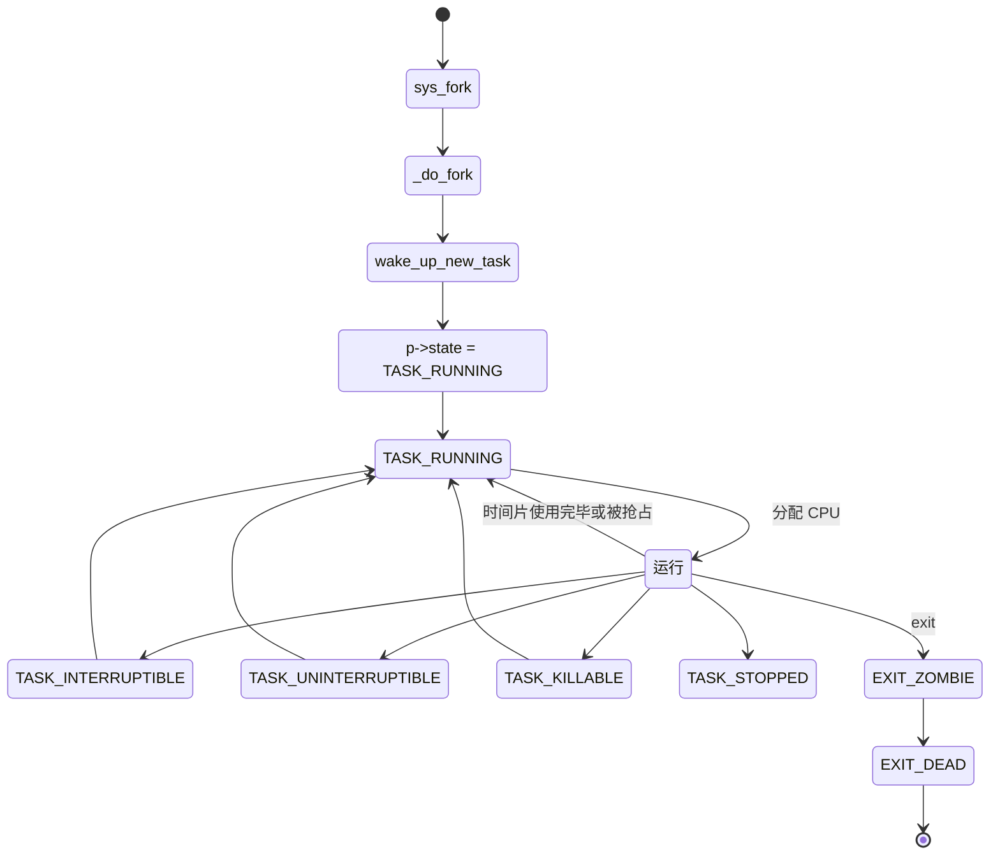
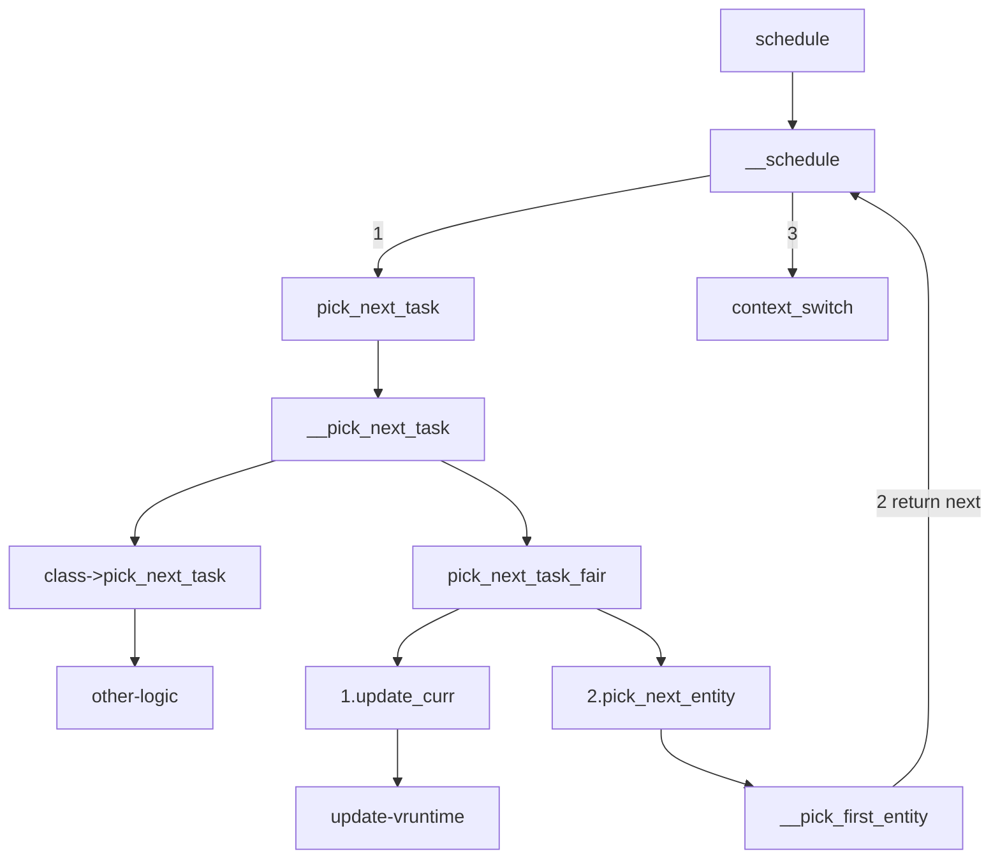
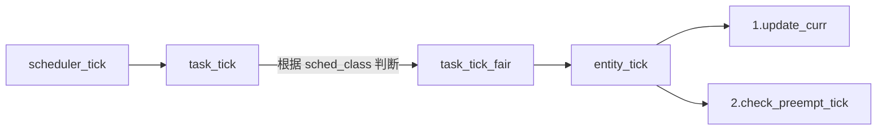
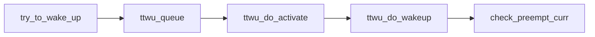

Linux 任务调度

## task_struct

在 Linux 里面，无论是进程还是线程，到了内核里面，统一都叫任务（Task），由一个统一的结构体 `task_struct` 进行管理


这个结构有点复杂，具体可以看相关 [代码](https://elixir.bootlin.com/linux/v5.19/source/include/linux/sched.h#L726)。

### 任务 ID

每一个任务都应该有一个任务 ID 作为唯一标识

[code](https://elixir.bootlin.com/linux/v5.19/source/include/linux/sched.h#L950)

``` c include/linux/sched.h
pid_t				pid;
pid_t				tgid;
// ......
/* Real parent process: */
struct task_struct __rcu	*real_parent;

/* Recipient of SIGCHLD, wait4() reports: */
struct task_struct __rcu	*parent;
/*
  * Children/sibling form the list of natural children:
  */
struct list_head		children;
struct list_head		sibling;
struct task_struct		*group_leader;
```

- pid（process ID）: 线程 ID
- tgid（thread group ID）：主线程 ID，当前线程就是主线程，那么 tgid 就是 pid
- parent: 指向其父进程。当它终止时，必须向它的父进程发送信号
- children: 表示链表的头部。链表中的所有元素都是它的子进程
- sibling: 用于把当前进程插入到兄弟链表中
- group_leader：指向进程的主线程

通过对比 tgid 和 pid 就可以知道当前 task_struct 是进程还是线程。如果只是想通过 ps 查看有多少进程，可以只展示 `pid == tgid` 的 task_struct，就不用把所有的都展示出来；如果想要结束一个进程，可以使用 kill 命令结束整个进程而不是线程。

> 当然也有发送信号给单个线程的情况：可以看 Go Runtime 的抢占式调度的实现

### 状态

在 task_struct 的状态 [code](https://elixir.bootlin.com/linux/v5.19/source/include/linux/sched.h#L83)

``` c include/linux/sched.h
/* Used in tsk->state: */
#define TASK_RUNNING			0x0000
#define TASK_INTERRUPTIBLE		0x0001
#define TASK_UNINTERRUPTIBLE		0x0002
#define __TASK_STOPPED			0x0004
#define __TASK_TRACED			0x0008
/* Used in tsk->exit_state: */
#define EXIT_DEAD			0x0010
#define EXIT_ZOMBIE			0x0020
#define EXIT_TRACE			(EXIT_ZOMBIE | EXIT_DEAD)
/* Used in tsk->state again: */
#define TASK_PARKED			0x0040
#define TASK_DEAD			0x0080
#define TASK_WAKEKILL			0x0100
#define TASK_WAKING			0x0200
#define TASK_NOLOAD			0x0400
#define TASK_NEW			0x0800
/* RT specific auxilliary flag to mark RT lock waiters */
#define TASK_RTLOCK_WAIT		0x1000
#define TASK_STATE_MAX			0x2000

/* Convenience macros for the sake of set_current_state: */
#define TASK_KILLABLE			(TASK_WAKEKILL | TASK_UNINTERRUPTIBLE)
#define TASK_STOPPED			(TASK_WAKEKILL | __TASK_STOPPED)
#define TASK_TRACED			__TASK_TRACED

#define TASK_IDLE			(TASK_UNINTERRUPTIBLE | TASK_NOLOAD)

/* Convenience macros for the sake of wake_up(): */
#define TASK_NORMAL			(TASK_INTERRUPTIBLE | TASK_UNINTERRUPTIBLE)

/* get_task_state(): */
#define TASK_REPORT			(TASK_RUNNING | TASK_INTERRUPTIBLE | \
					 TASK_UNINTERRUPTIBLE | __TASK_STOPPED | \
					 __TASK_TRACED | EXIT_DEAD | EXIT_ZOMBIE | \
					 TASK_PARKED)
```

`TASK_RUNNING` 并不是说进程正在运行，而是表示进程在时刻准备运行的状态。当处于这个状态的进程获得时间片的时候，就是在运行中；如果没有获得时间片，就说明它被其他进程抢占了，等待再次分配时间片。运行中的进程，一旦要进行一些 I/O 操作，需要等待 I/O 操作完毕，这个时候会主动释放 CPU，进入睡眠状态，在 Linux 中，有两种睡眠状态

- TASK_INTERRUPTIBLE：可中断的睡眠状态。虽然在睡眠，等待 I/O 完成，但是这个时候一个信号来的时候，进程还是要被唤醒，只是唤醒之后不是继续刚才的操作，而是进行信号处理；
- TASK_UNINTERRUPTIBLE：不可中断的睡眠状态。只能等待 I/O 完成，连 kill 信号也会被忽略。除非重启电脑，没有其他办法；
- TASK_KILLABLE：可终止的睡眠状态。进程处于这种状态中，原理和 TASK_UNINTERRUPTIBLE 类似，只不过是可以响应 kill 信号；
- TASK_STOPPED：在进程收到 SIGSTOP、SIGTTIN、SIGTSTP 或者 SIGTTOU 信号之后进入该状态；
- TASK_TRACED：表示进程被 debugger 等进程监控，进程执行被调试程序所停止。当一个进程被另外的进程所监视，每一个信号都会让该进程进入这个状态；
- EXIT_ZOMBIE：一旦一个进程要结束，先进入这个状态，但是这个时候它的父进程还没有使用 wait() 等系统调用来获取它的终止信息，此时进程就成了僵尸进程；
- EXIT_DEAD：是进程的最终状态

状态转换如下所示：



### 运行统计信息

主要包含在下面这些字段中 [code](https://elixir.bootlin.com/linux/v5.19/source/include/linux/sched.h#L1002)

```c include/linux/sched.h
	u64				utime;  // 用户态消耗的 CPU 时间
	u64				stime;  // 内核态消耗的 CPU 时间
#ifdef CONFIG_ARCH_HAS_SCALED_CPUTIME
	u64				utimescaled;
	u64				stimescaled;
#endif
	u64				gtime;
	struct prev_cputime		prev_cputime;
#ifdef CONFIG_VIRT_CPU_ACCOUNTING_GEN
	struct vtime			vtime;
#endif

#ifdef CONFIG_NO_HZ_FULL
	atomic_t			tick_dep_mask;
#endif
	/* Context switch counts: */
	unsigned long			nvcsw;  // 自愿(voluntary)上下文切换计数
	unsigned long			nivcsw; // 非自愿(involuntary)上下文切换计数

	/* Monotonic time in nsecs: */
	u64				start_time;     // 进程启动时间，不包含睡眠时间

	/* Boot based time in nsecs: */
	u64				start_boottime; // 进程启动时间，包含睡眠时间
```

## 调度原理

在 Linux 里面，进程可以分为两种：实时进程和普通进程。

- 实时进程：需要尽快执行返回结果的那种
- 普通进程：大部分进程其实都是这种

### 调度策略

在 task_struct 中 的 [policy](https://elixir.bootlin.com/linux/v5.19/source/include/linux/sched.h#L816) 用来表示调度策略，有以下一些策略 [code](https://elixir.bootlin.com/linux/v5.19/source/include/uapi/linux/sched.h#L114)

``` c include/uapi/linux/sched.h
/*
 * Scheduling policies
 */
#define SCHED_NORMAL		0  // SCHED_OTHER
#define SCHED_FIFO		1
#define SCHED_RR		2
#define SCHED_BATCH		3
/* SCHED_ISO: reserved but not implemented yet */
#define SCHED_IDLE		5
#define SCHED_DEADLINE		6
```

配合调度策略的，还有优先级

``` c include/linux/sched.h
int				prio;
int				static_prio;
int				normal_prio;
unsigned int			rt_priority;
```

优先级其实就是一个数值，对于实时进程，优先级范围是 0～99；对于普通进程，优先级范围是 100~139。数值越小，优先级越高。

#### 实时调度策略

SCHED_FIFO、SCHED_RR、SCHED_DEADLINE 是实时进程的调度策略

- SCHED_FIFO：先来先执行
- SCHED_RR：轮流调度，采用时间片，相同优先级的任务当用完时间片会被放到队列尾部，以保证公平性，而更高优先级的任务也是可以抢占低优先级的任务
- SCHED_DEADLINE：按照任务的 deadline 进行调度的。DL 调度器总是选择其 deadline 距离当前时间点最近的那个任务，并调度它执行

#### 普通调度策略

SCHED_NORMAL、SCHED_BATCH、SCHED_IDLE 是普通进程的调度策略

- SCHED_NORMAL: 普通进程一般都是这个调度策略
- SCHED_BATCH: 后台进程，几乎不需要和前段进行交互
- SCHED_IDLE: 特别空闲的时候才跑的进程

#### 修改/查看调度策略

``` shell
!690 # chrt -p 3986612
pid 3986612's current scheduling policy: SCHED_OTHER
pid 3986612's current scheduling priority: 0

!698 # chrt  -f -p 10 3986612
pid 3986612's current scheduling policy: SCHED_FIFO
pid 3986612's current scheduling priority: 10

!692 # chrt
Show or change the real-time scheduling attributes of a process.

Set policy:
 chrt [options] <priority> <command> [<arg>...]
 chrt [options] --pid <priority> <pid>

Get policy:
 chrt [options] -p <pid>

Policy options:
 -b, --batch          set policy to SCHED_BATCH
 -d, --deadline       set policy to SCHED_DEADLINE
 -f, --fifo           set policy to SCHED_FIFO
 -i, --idle           set policy to SCHED_IDLE
 -o, --other          set policy to SCHED_OTHER
 -r, --rr             set policy to SCHED_RR (default)

Scheduling options:
 -R, --reset-on-fork       set SCHED_RESET_ON_FORK for FIFO or RR
 -T, --sched-runtime <ns>  runtime parameter for DEADLINE
 -P, --sched-period <ns>   period parameter for DEADLINE
 -D, --sched-deadline <ns> deadline parameter for DEADLINE

Other options:
 -a, --all-tasks      operate on all the tasks (threads) for a given pid
 -m, --max            show min and max valid priorities
 -p, --pid            operate on existing given pid
 -v, --verbose        display status information

 -h, --help     display this help and exit
 -V, --version  output version information and exit

For more details see chrt(1).
```

不管是 policy 还是 priority，都是一个变量，真正做调度的是 [sched_class](https://elixir.bootlin.com/linux/v5.19/source/include/linux/sched.h#L780)

### 调度策略实现

sched_class 有这些实现 [code](https://elixir.bootlin.com/linux/v5.19/source/kernel/sched/sched.h#L2213)

``` c kernel/sched/sched.h
extern const struct sched_class stop_sched_class;
extern const struct sched_class dl_sched_class;
extern const struct sched_class rt_sched_class;
extern const struct sched_class fair_sched_class;
extern const struct sched_class idle_sched_class;
```

- stop_sched_class: 优先级最高的任务会使用这种策略，会中断所有其他线程，且不会被其他任务打断
- dl_sched_class: 对应 deadline 调度策略
- rt_sched_class: 对应 RR 算法或者 FIFO 算法的调度策略，具体调度策略由 task_struct->policy 指定
- fair_sched_class: 普通进程的调度策略
- idle_sched_class: 空闲进程的调度策略

这里实时进程的调度策略 RR 和 FIFO 相对简单一些，平时遇到的基本上都是普通进程，这里重点分析普通进程的调度，也就是 fair_sched_class。

### CFS

在 Linux 里面，实现了一个基于 CFS(Completely Fair Scheduling) 的调度算法。CPU 会提供一个时钟，过一段时间就触发一个时钟中断。CFS 为每个进程设置一个虚拟运行时间 vruntime。如果一个进程在运行，随着时间的增加，也就是一个个 tick 的到来，进程的 vruntime 将不断增大。没有得到运行的进程 vruntime 不变。vruntime 小的进程，会优先运行进程。[code](https://elixir.bootlin.com/linux/v5.19/source/kernel/sched/fair.c#L888)

``` c kernel/sched/fair.c
/*
 * Update the current task's runtime statistics.
 */
static void update_curr(struct cfs_rq *cfs_rq)
{
	struct sched_entity *curr = cfs_rq->curr;
	u64 now = rq_clock_task(rq_of(cfs_rq));
	u64 delta_exec;

	if (unlikely(!curr))
		return;

	delta_exec = now - curr->exec_start;
	if (unlikely((s64)delta_exec <= 0))
		return;

	curr->exec_start = now;

	// ......

	curr->vruntime += calc_delta_fair(delta_exec, curr);
	update_min_vruntime(cfs_rq);
	// ......
}

/*
 * delta /= w
 */
static inline u64 calc_delta_fair(u64 delta, struct sched_entity *se)
{
	if (unlikely(se->load.weight != NICE_0_LOAD))
		delta = __calc_delta(delta, NICE_0_LOAD, &se->load);

	return delta;
}

// include/linux/sched.h
struct sched_entity {
	/* For load-balancing: */
	struct load_weight		load;
	struct rb_node			run_node;
	struct list_head		group_node;
	unsigned int			on_rq;

	u64				exec_start;
	u64				sum_exec_runtime;
	u64				vruntime;
	u64				prev_sum_exec_runtime;
	// ......
};
```

开始运行的时间减去当前时间，就是这次运行的时间 delta_exec，然后通过 calc_delta_fair 计算得到最终的 vruntime

> vruntime += 真实运行的时间 * NICE_0_LOAD / 进程权重

进程每次运行完毕后就会更新 vruntime，然后选择 vruntime 最小的进程继续运行，这将由红黑树完成。

### 调度队列与调度实体

上面说到的红黑树的节点，应该是包括 vruntime 的，称为调度实体，在 task_struct 中，有这些[变量](https://elixir.bootlin.com/linux/v5.19/source/include/linux/sched.h#L777)

``` c include/linux/sched.h
// task_struct
struct sched_entity		se;		// CFS 公平算法调度实体
struct sched_rt_entity		rt; // 实时调度实体
struct sched_dl_entity		dl;	// Deadline 调度实体

struct sched_entity {
	/* For load-balancing: */
	struct load_weight		load;
	struct rb_node			run_node;
	struct list_head		group_node;
	unsigned int			on_rq;

	u64				exec_start;
	u64				sum_exec_runtime;
	u64				vruntime;
	u64				prev_sum_exec_runtime;

	u64				nr_migrations;
	// ......
};
```

进程根据自己是实时的，还是普通的，通过变量将自己挂到某一个调度队列里面，和其它进程排序，等待被调度。如果是普通进程，就将 sched_entity 挂到红黑树上。而真正维护这些队列的就是 CPU，所以每个 CPU 都有自己的 [`struct rq`](https://elixir.bootlin.com/linux/v5.19/source/kernel/sched/sched.h#L918) 结构

``` c kernel/sched/sched.h

struct rq {
	/* runqueue lock: */
	raw_spinlock_t		__lock;

	/*
	 * nr_running and cpu_load should be in the same cacheline because
	 * remote CPUs use both these fields when doing load calculation.
	 */
	unsigned int		nr_running;
	// ......

	struct cfs_rq		cfs;	// CFS 运行队列
	struct rt_rq		rt;		// 实时进程运行队列
	struct dl_rq		dl;		// Deadline 运行队列
	// ......

	/*
	 * This is part of a global counter where only the total sum
	 * over all CPUs matters. A task can increase this counter on
	 * one CPU and if it got migrated afterwards it may decrease
	 * it on another CPU. Always updated under the runqueue lock:
	 */
	unsigned int		nr_uninterruptible;

	struct task_struct __rcu	*curr;
	struct task_struct	*idle;
	struct task_struct	*stop;
	// ......
};
```

对于普通进程公平队列 cfs_rq 中的 [`tasks_timeline`](https://elixir.bootlin.com/linux/v5.19/source/kernel/sched/sched.h#L542) 就是指向红黑树的根节点。调度的时候会先判断是否有实时进程需要运行，如果没有，才会去 CFS 运行队列面找 vruntime 最小的进程运行

``` c kernel/sched/core.c
/*
 * Pick up the highest-prio task:
 */
static inline struct task_struct *
__pick_next_task(struct rq *rq, struct task_struct *prev, struct rq_flags *rf)
{
	const struct sched_class *class;
	struct task_struct *p;

	/*
	 * Optimization: we know that if all tasks are in the fair class we can
	 * call that function directly, but only if the @prev task wasn't of a
	 * higher scheduling class, because otherwise those lose the
	 * opportunity to pull in more work from other CPUs.
	 */
	if (likely(!sched_class_above(prev->sched_class, &fair_sched_class) &&
		   rq->nr_running == rq->cfs.h_nr_running)) {

		p = pick_next_task_fair(rq, prev, rf);
		if (unlikely(p == RETRY_TASK))
			goto restart;

		/* Assume the next prioritized class is idle_sched_class */
		if (!p) {
			put_prev_task(rq, prev);
			p = pick_next_task_idle(rq);
		}

		return p;
	}

restart:
	put_prev_task_balance(rq, prev, rf);

	for_each_class(class) {
		p = class->pick_next_task(rq);
		if (p)
			return p;
	}

	BUG(); /* The idle class should always have a runnable task. */
}
```

这里的 `for_each_class` 就是 [依次](https://elixir.bootlin.com/linux/v5.19/source/kernel/sched/sched.h#L2213) 循环，调用每个调度类的方法。这样整个运行的场景就可以串起来了，在每个 CPU 上都有一个队列 rq，这个队列包含了不同优先级的队列：rt_rq、cfs_rq 等，不同队列实现方式不一样，当某个 CPU 需要找下一个任务执行的时候，会按照优先级依次调用调度类，第一个没有找到才能找下一个调度类的任务，最终找到下个任务继续运行，这样就能保证实时任务的优先级永远大于普通任务。

## 调度

计算机主要处理计算、网络、存储三个方面。计算主要是 CPU 和内存的合作；网络和存储则多是和外部设备合作；在操作外部设备的时候，往往需要让出 CPU，调用 [`schedule()`](https://elixir.bootlin.com/linux/v5.19/source/kernel/sched/core.c#L6523) 函数

``` c kernel/sched/core.c
asmlinkage __visible void __sched schedule(void)
{
	struct task_struct *tsk = current;

	sched_submit_work(tsk);
	do {
		preempt_disable();
		__schedule(SM_NONE);
		sched_preempt_enable_no_resched();
	} while (need_resched());
	sched_update_worker(tsk);
}
EXPORT_SYMBOL(schedule);
```

schedule 的主要逻辑都是在 `__schedule` 里面实现的

### __schedule



- 取出当前 CPU 上的任务队列 rq，以及正在运行的进程 curr
- 获取下一个要执行的任务
- 如果是 CFS，就要更新 vruntime，然后取红黑树最左边的节点(vruntime 最小的任务)
- 判断当前进程和下一个要执行的任务是否是同一个任务，如果不是，调用 context_switch

[context_switch](https://elixir.bootlin.com/linux/v5.19/source/kernel/sched/core.c#L5094) 主要的逻辑就是上下文切换

- 切换进程空间，即虚拟内存
- 切换寄存器和 CPU 上下文

task_struct 里面有一个 [thread](https://elixir.bootlin.com/linux/v5.19/source/include/linux/sched.h#L1510) 的变量，保留了要切换进程的时候需要修改的寄存器。

进程调度都会走到 __schedule 这里，如果是主动调用 schedule 就是主动让出，那如果不主动让出呢？

### 抢占式调度

#### 抢占过程

最常见的现象就是一个进程执行时间太长，不主动让出 CPU，这个时候不能一直让这个进程继续运行，需要切换到另外一个进程。衡量这个时间点，就是计算机里面的时钟，每过一段时间（调度周期）就会触发一次时钟中断，这个时候 CPU 会切换任务去响应这个时钟中断，这个时候就可以查看是否需要抢占。时钟中断处理函数主要是 [scheduler_tick](https://elixir.bootlin.com/linux/v5.19/source/kernel/sched/core.c#L5400)



主要的就是 [check_preempt_tick](https://elixir.bootlin.com/linux/v5.19/source/kernel/sched/fair.c#L4485)，检查是否是应该抢占当前进程

``` c kernel/sched/fair.c
/*
 * Preempt the current task with a newly woken task if needed:
 */
static void
check_preempt_tick(struct cfs_rq *cfs_rq, struct sched_entity *curr)
{
	unsigned long ideal_runtime, delta_exec;
	struct sched_entity *se;
	s64 delta;

  // ideal_runtime 一个调度周期中，运行的“实际”(理论)时间
	ideal_runtime = sched_slice(cfs_rq, curr);
  // delta_exec 这次调度运行的时间
	delta_exec = curr->sum_exec_runtime - curr->prev_sum_exec_runtime;
	if (delta_exec > ideal_runtime) {
		resched_curr(rq_of(cfs_rq));
		/*
		 * The current task ran long enough, ensure it doesn't get
		 * re-elected due to buddy favours.
		 */
		clear_buddies(cfs_rq, curr);
		return;
	}

	/*
	 * Ensure that a task that missed wakeup preemption by a
	 * narrow margin doesn't have to wait for a full slice.
	 * This also mitigates buddy induced latencies under load.
	 */
	if (delta_exec < sysctl_sched_min_granularity)
		return;

  // 取出红黑树最小的进程
	se = __pick_first_entity(cfs_rq);
	delta = curr->vruntime - se->vruntime;

	if (delta < 0)
		return;

	if (delta > ideal_runtime)
		resched_curr(rq_of(cfs_rq));
}
```

如果发现当前进程运行过长或者当前进程的 vruntime 大于红黑树中最小的进程的 vruntime，就会调用 resched_curr 标记当前进程为被抢占，而不是真正的抢占，而是打上一个标签 TIF_NEED_RESCHED

另外一个可能抢占的场景就是当一个进程被唤醒的时候。当一个进程在等待 I/O 当时候，会主动放弃 CPU，但是当 I/O 到来的时候，进程往往会被唤醒。这时候是一个时机。当被唤醒的进程优先级高于 CPU 上的当前进程，就会触发抢占。



到这里，只是把进程标记为被抢占，但是没有发生真正的抢占动作

#### 抢占时机

真正的抢占时机，是让正在运行的进程有激活调用 schedule。

对于用户态进程来讲，从系统调用返回的那个时候，就是一个被抢占的时机。

对于内核态的执行中，被抢占的时机一般发生在 preempt_enable() 中。对于内核有些操作不能被中断，所以一般都会 preempt_disable() 关闭抢占，当再次打开就是一次抢占的机会。还有就是从中断返回的时候返回的也是内核态，这个时候也是一个执行抢占的时机。

--------

参考链接:

- [https://mp.weixin.qq.com/s/HFQL5d-C24DKjQbYAQfl8g](https://mp.weixin.qq.com/s/HFQL5d-C24DKjQbYAQfl8g)
- [https://mp.weixin.qq.com/s?__biz=Mzk0MjE3NDE0Ng==&mid=2247501576&idx=1&sn=657e1c89d1007a935820d394d64f4035&scene=21#wechat_redirect](https://mp.weixin.qq.com/s?__biz=Mzk0MjE3NDE0Ng==&mid=2247501576&idx=1&sn=657e1c89d1007a935820d394d64f4035&scene=21#wechat_redirect)
- [https://zhuanlan.zhihu.com/p/79772089](https://zhuanlan.zhihu.com/p/79772089)
- [https://www.jianshu.com/p/0d90b92000c0](https://www.jianshu.com/p/0d90b92000c0)
- [https://segmentfault.com/a/1190000039367851?utm_source=sf-similar-article](https://segmentfault.com/a/1190000039367851?utm_source=sf-similar-article)
- [https://www.cnblogs.com/chaojiyingxiong/p/15799617.html](https://www.cnblogs.com/chaojiyingxiong/p/15799617.html)
- [http://www.wowotech.net/process_management/scheduler-history.html](http://www.wowotech.net/process_management/scheduler-history.html)
- [https://www.ibm.com/developerworks/cn/linux/l-cn-scheduler/index.html](https://www.ibm.com/developerworks/cn/linux/l-cn-scheduler/index.html)
- [https://www.jianshu.com/p/673c9e4817a8](https://www.jianshu.com/p/673c9e4817a8)
- [https://blog.eastonman.com/blog/2021/02/cfs/](https://blog.eastonman.com/blog/2021/02/cfs/)
- [https://www.kernel.org/doc/html/latest/scheduler/sched-design-CFS.html](https://www.kernel.org/doc/html/latest/scheduler/sched-design-CFS.html)
- [https://time.geekbang.org/column/intro/100024701?tab=catalog](https://time.geekbang.org/column/intro/100024701?tab=catalog)
